# 使用教程

> 说明：本项目代码开源，承诺不会收集或泄露任何个人隐私信息。如遇隐私相关问题，请核实软件安装包来源。

## 声明

本工具仅供个人求职辅助使用。使用过程中请遵守各招聘平台的服务条款，合理适度使用自动化功能。开发者不承担因使用本工具可能引起的账号限制、数据丢失或其他任何损失的责任。

## 安装软件

- 最新版下载地址：[https://github.com/OpenFuckJob/FuckJob/releases](https://github.com/OpenFuckJob/FuckJob/releases)

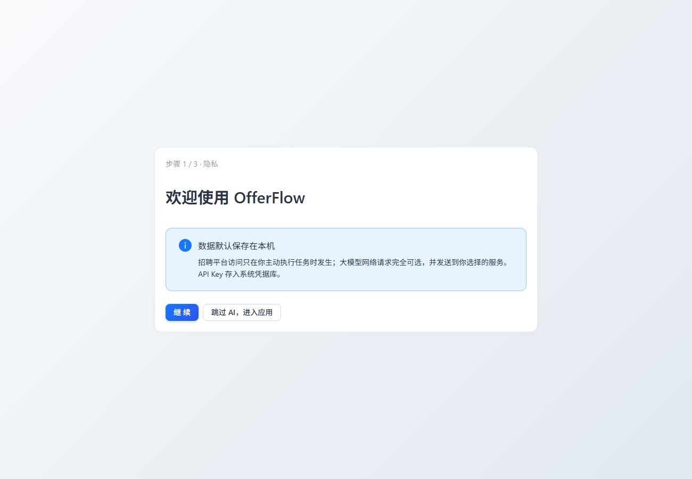

## 初始化配置

### 1. 浏览器环境配置

软件会自动检测本地已安装的 Chrome 内核浏览器，优先识别 Google Chrome，其次为 Microsoft Edge。

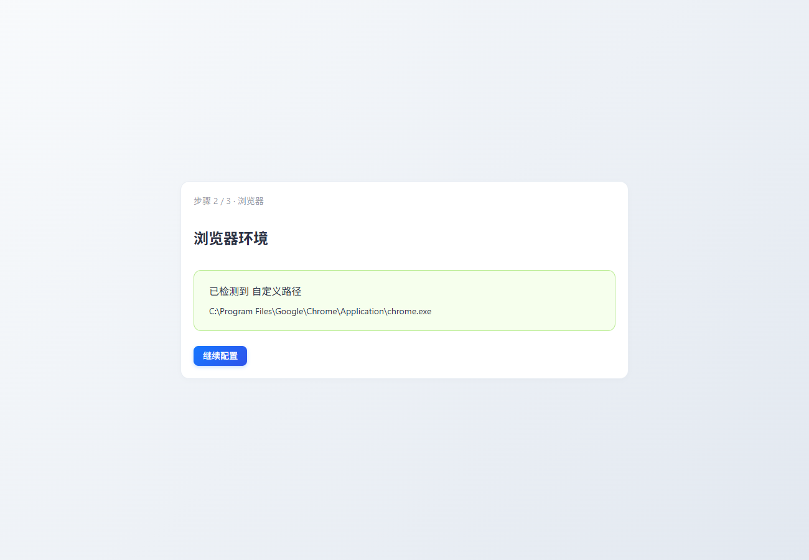

如果已安装 Google Chrome 但未被检测到，请打开浏览器访问 [chrome://version](chrome://version)，手动复制可执行文件路径并填入配置。

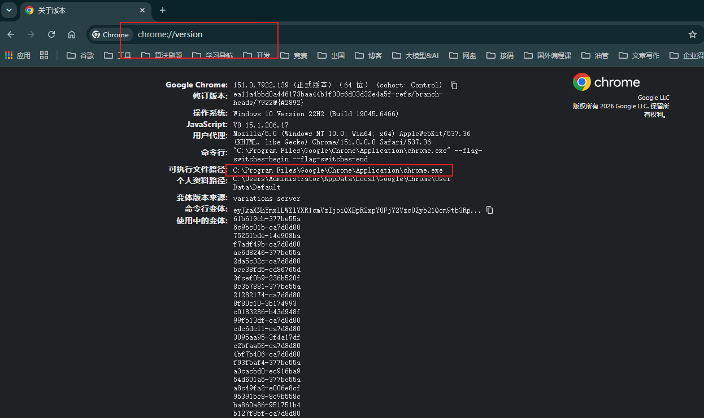

> Edge 浏览器请访问：[edge://version](edge://version)

### 2. 大模型配置

> 熟悉大模型 API 调用的用户可自行配置；不熟悉的请按以下步骤操作。

进入 DeepSeek 开放平台：[https://platform.deepseek.com/](https://platform.deepseek.com/)，建议先充值少量金额（按实际使用量扣费）。

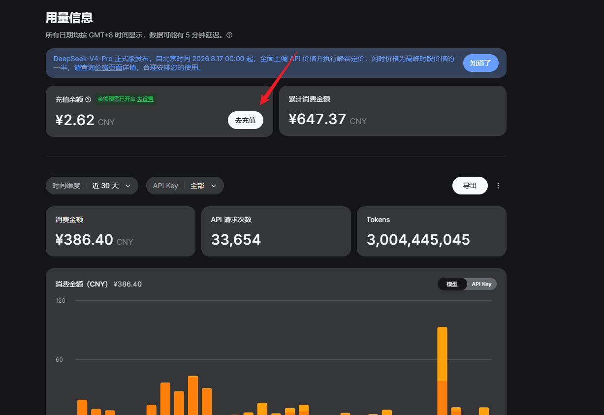

在平台中创建一个新的 API Key。

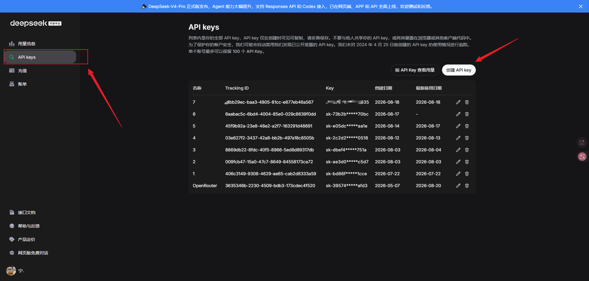

在软件中选择 DeepSeek 模型，填入 API Key 和模型名称，然后点击测试连接。

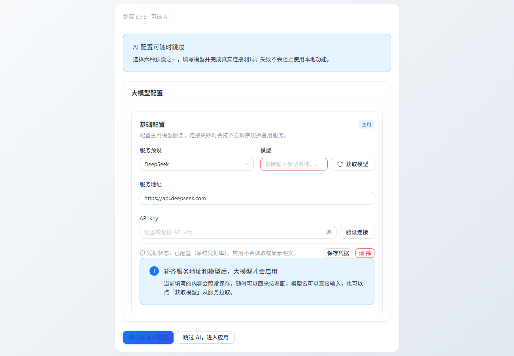

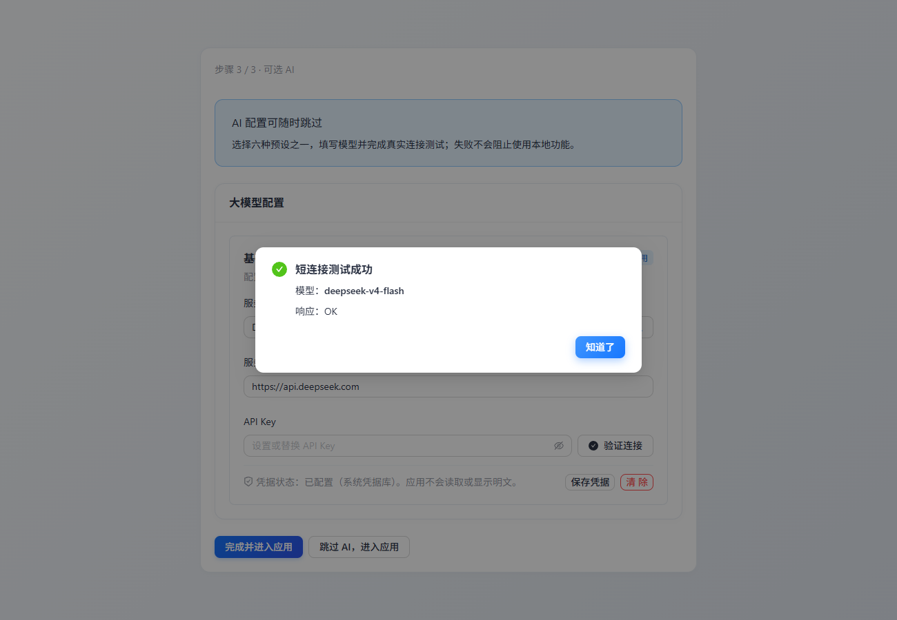

> 注意：**请先保存凭证信息，再点击验证连接。**

## 简历配置

进入「配置中心」→「简历配置」，上传 PDF 格式的简历文件，并开启「注入 LLM 上下文」选项。

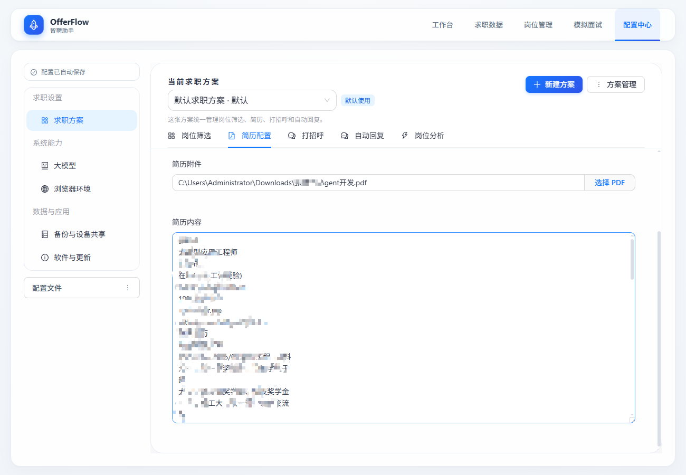

## 岗位筛选

在配置中心根据个人需求设置岗位筛选条件。

- **AI 意图符合**：开启后，模型会根据岗位信息自动判断是否匹配投递要求，帮助识别虚假或偏离的岗位描述。

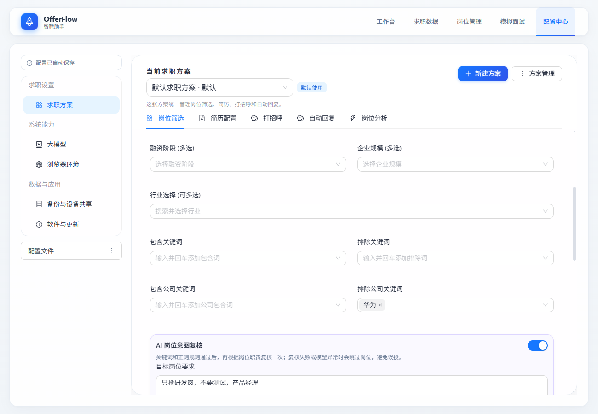

- 建议开启「拟人化」功能，降低被风控系统识别的概率。

## 打招呼配置

开启 LLM 打招呼功能，并按需填写提示词。参考模板如下：

```txt
你是一个求职者，正在BOSS直聘上与招聘方沟通。请根据以下内容生成一段开场的打招呼用语。

【严格要求】
1. 严禁使用任何占位符，例如“X年”、“Y年”、“某技术”、“XX公司”等。也不要用括号标注“待补充”之类的内容。
2. 如果简历（见下方“我的简历”）为空或缺少某些信息（如工作年限、具体技能），请使用模糊但自然的说法，例如“我有相关经验”、“熟悉该领域”、“有多年实践经验”等。绝对不能编造具体数字或占位符。
3. 必须保证生成的文本是可以直接发送给HR的完整句子，无需人工修改。
4. 总字数控制在60~120字。
5. 结尾以开放式提问结束，例如“方便进一步沟通吗？”或“您觉得我的方向匹配吗？”。

【示例】
简历为空或信息很少时，正确写法：
“您好，我对贵公司招聘的Java开发岗很感兴趣。我熟悉Spring Cloud等微服务框架，有相关项目经验。看到岗位中涉及高并发系统设计，这正是我所擅长的方向。方便进一步沟通吗？”
错误写法（包含占位符）：
“我有X年Java经验” 或 “我有3年经验（但实际上没有提供）”。

=== 我的简历（可能为空） ===
{{resume_context}}

=== 当前岗位信息 ===
{{job_content}}

请直接输出打招呼文本，不要加额外解释。
```

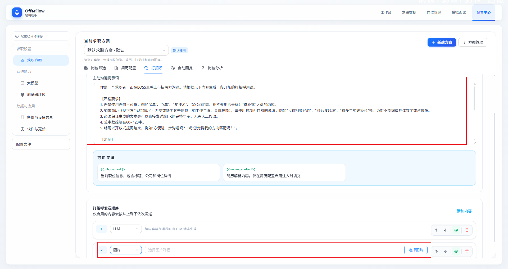

建议补充一份简历图片，方便 HR 直接预览，无需下载附件即可了解基本信息。

## 自动回复

如希望简化沟通流程，可选择「仅 AI 回复」模式，并填写自动回复提示词。参考模板如下：

```txt
你现在是一名在 Boss直聘 平台上和 HR 沟通的求职者。

系统会提供以下上下文：

1. 当前岗位信息；
2. 求职者个人简历；
3. 历史聊天记录；
4. 额外补充说明（可选）。

你的任务：

* 结合上下文，生成一条适合发送给 HR 的回复；
* 回复风格真实自然，符合中文求职聊天习惯；
* 回复要简短，不啰嗦，避免长篇大论；
* 保持礼貌、职业化，但不要过于正式；
* 优先突出岗位匹配度、沟通意愿、到岗时间、项目经验等关键信息；
* 如果 HR 提问，直接回答问题，不要答非所问；
* 如果信息不足，可以礼貌追问；
* 避免模板化、机械化表达；
* 输出仅包含最终回复内容，不要添加解释。

输入格式：
【岗位信息】
{{job_description}}

【个人简历】
{{resume}}

【额外补充】
{{background_context}}

【历史聊天】
{{chat_history}}

请生成一条适合发送给 HR 的简短回复。
```

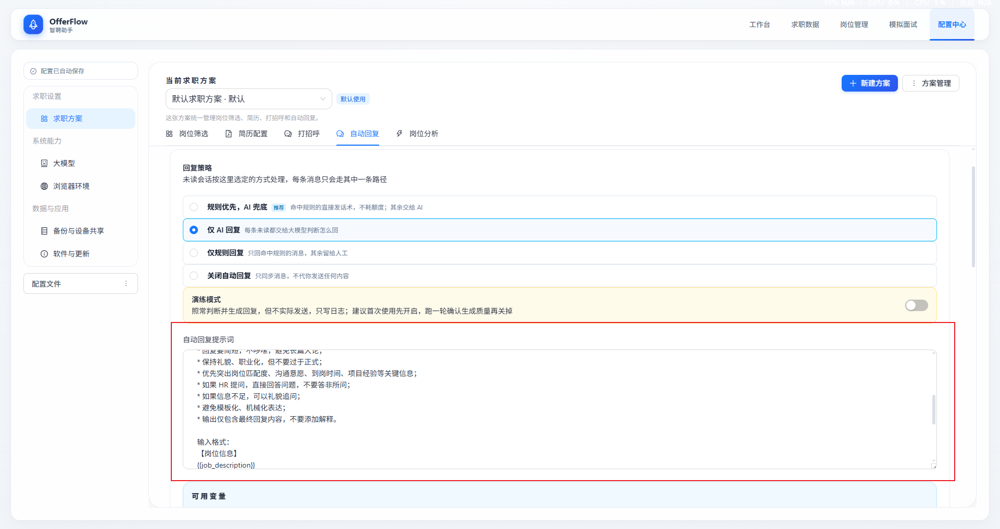

## 岗位分析

> 可根据需要选择性开启此功能。

## 启动运行

1. 先执行环境检查

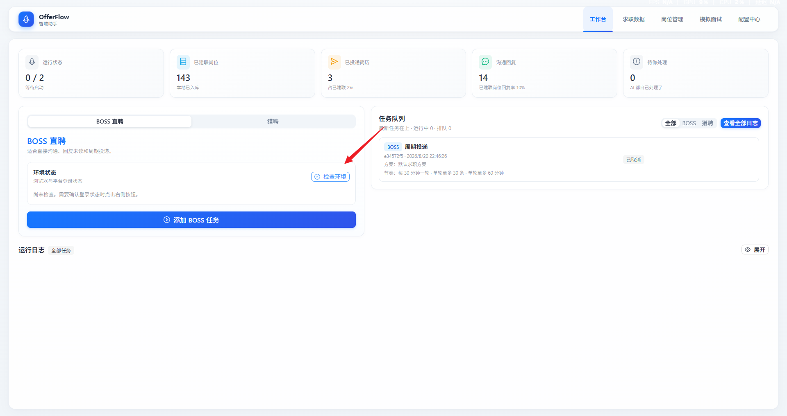

软件会自动检测浏览器环境和 Boss 直聘账号登录状态。如未登录，会展示登录二维码，如下图所示：

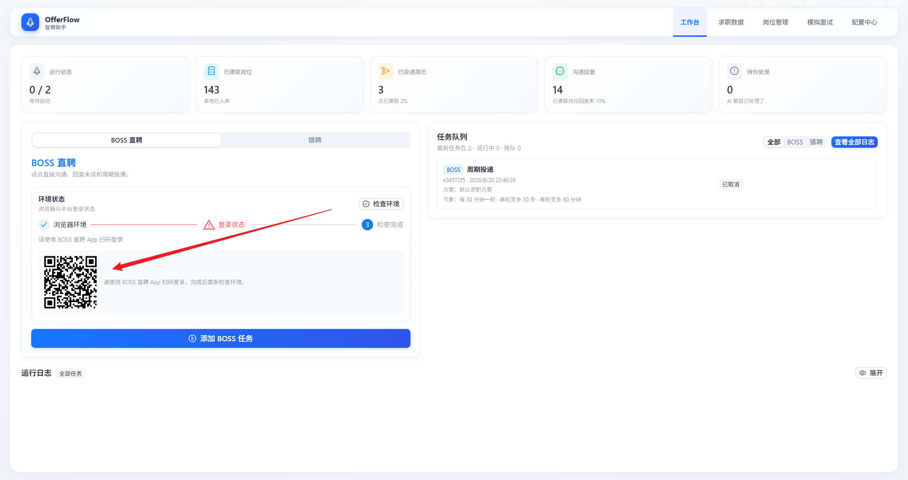

使用 Boss 直聘 App 扫码登录即可。

2. 在「工作台」中添加任务并开始运行

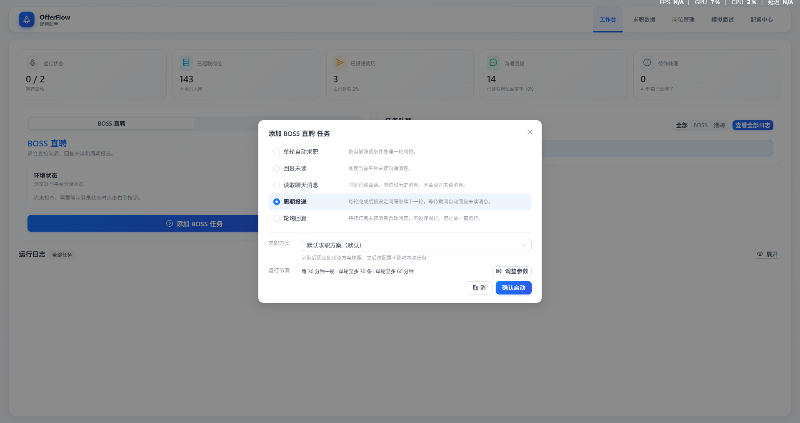

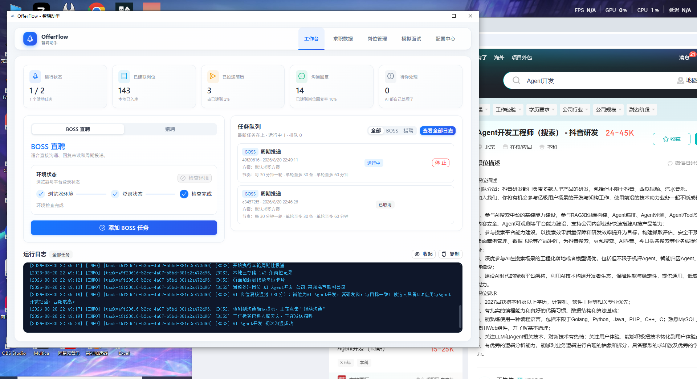